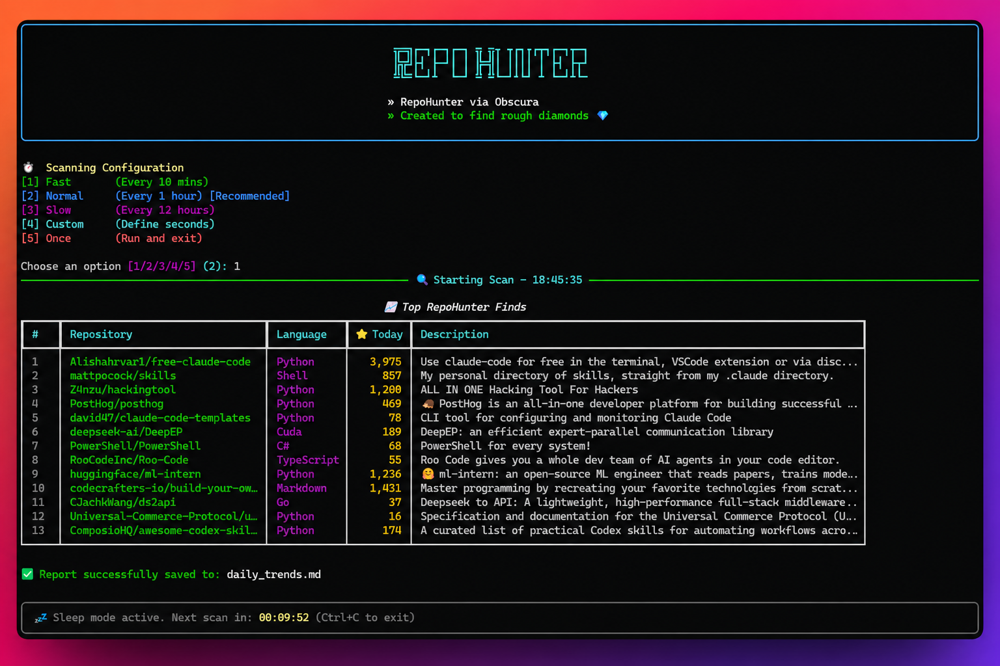

<div align="center">


<a href="https://github.com/AxthonyV/RepoHunter">
  
</a>

<br/>

[](https://python.org)
[](https://github.com/AxthonyV/RepoHunter)
[](LICENSE)

</div>

---

## ⚡ What is RepoHunter?

RepoHunter is an automated bot that hunts for the "cream of the crop" GitHub repositories on auto-pilot. It uses stealth browsing (powered by Obscura) to bypass anti-bot detections, formats the best daily finds into a clean `daily_trends.md` file ready for Twitter threads, and features a beautiful multi-language CLI dashboard that runs continuously.

It features full **Cross-Platform Auto-Detection**, seamlessly working on Windows, macOS, and Linux right out of the box without requiring any manual path configuration.

---

## 📸 Preview



---

## 🚀 Getting Started

### Prerequisites
RepoHunter comes bundled with the **Obscura** binary for all operating systems. You don't need to download anything else. The included binaries are tracked automatically:
- `obscura-windows`
- `obscura-macos`
- `obscura-linux`

### Installation

```bash
# Clone the repository
git clone https://github.com/AxthonyV/RepoHunter.git
cd RepoHunter

# Install dependencies
pip install -r requirements.txt
```

*(Mac/Linux users: If you get a permission error, ensure the binary is executable by running `chmod +x obscura-linux/obscura` or `chmod +x obscura-macos/obscura`).*

### Usage

```bash
# Start the bot
python repo_hunter.py
```
*The script will automatically detect your OS, load the correct bundled Obscura binary behind the scenes, and launch the interactive dashboard.*

---

## 🤝 Contributing (Forks Welcome)

We love contributions! Have ideas to make the CLI even cooler or integrate with AI generation APIs? 

1. Fork the Project
2. Create your Feature Branch (`git checkout -b feature/AmazingFeature`)
3. Commit your Changes (`git commit -m 'Add some AmazingFeature'`)
4. Push to the Branch (`git push origin feature/AmazingFeature`)
5. Open a Pull Request

---

## 🙏 Credits

This tool relies heavily on [Obscura](https://github.com/h4ckf0r0day/obscura) for stealth web scraping. Huge thanks to the developers of Obscura for creating an incredible open-source headless browser built in Rust.

---

## 👤 Author


**AxthonyV**
- GitHub: [@AxthonyV](https://github.com/AxthonyV)

If you find this useful, consider starring the repository ⭐
